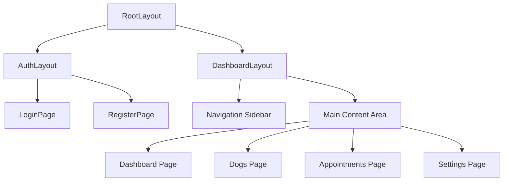

# Component Structure Documentation

## Main Layout Structure

## Key Components Breakdown

### Authentication Components
- **AuthLayout**
  - Handles authentication flow
  - Login/Register forms
  - Password reset functionality

### Dashboard Components
- **DashboardOverview**
  - Quick statistics
  - Recent activities
  - Upcoming appointments
  - Due vaccinations/deworming

- **DogsList**
  - DataTable view of all dogs
  - Searchable and sortable
  - Actions column with quick links
  - Add/Edit/Delete functionality

### Dog Management Components
- **DogForm**
  - Add/Edit dog information
  - Image upload capability
  - Form validation

- **DogDetails**
  - Tabbed interface for:
    - Basic information
    - Health records
    - Appointments
    - Documents

### Shared Components
- **DataTable**
  - Reusable table component
  - Column sorting
  - Pagination
  - Search functionality
  - Row selection

- **Forms**
  - Form input components
  - Date pickers
  - Select dropdowns
  - File uploaders

## Design System

### Color Scheme
- Primary: Blue-600 (#2563EB)
- Secondary: Gray-600
- Success: Green-500
- Error: Red-500
- Warning: Yellow-500

### Responsive Design
- Mobile-first approach
- Breakpoints:
  - sm: 640px
  - md: 768px
  - lg: 1024px
  - xl: 1280px