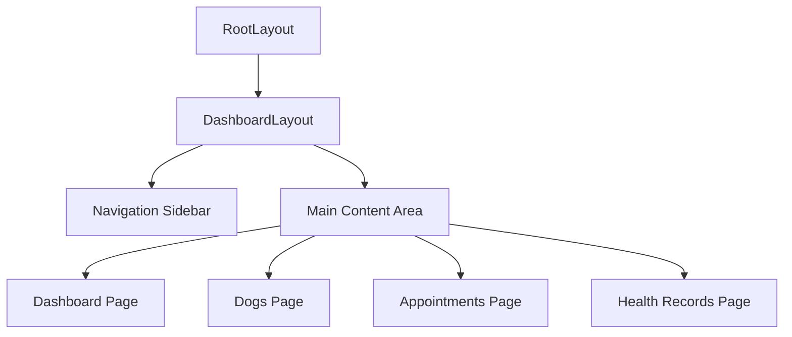

# Component Structure Documentation

## Main Layout Structure

## Key Components Breakdown

### Dashboard Components
- **HealthMetrics**
  - Shows overview statistics
  - Displays counts for:
    - Total dogs
    - Upcoming vaccinations
    - Due deworming

- **DogList**
  - Table view of all dogs
  - Quick access to dog profiles
  - Add new dog functionality

### Dog-Related Components
- **DogProfile**
  - Basic dog information
  - Medical notes
  - Edit capabilities

- **DogHealthRecords**
  - Vaccination history
  - Deworming records
  - Timeline view

### Appointment Components
- **AppointmentsPage**
  - Table of all appointments
  - Status indicators
  - Filtering options
  - Add new appointment button

## Design Notes for UI/UX

### Color Scheme
- Primary actions: Indigo-600 (#4F46E5)
- Success states: Green-100/800
- Warning states: Red-100/800
- Info states: Blue-100/800
- Neutral text: Gray-500/900

### Responsive Behavior
- Desktop: Full sidebar visible
- Mobile: Collapsible sidebar with hamburger menu
- Tables become scrollable on smaller screens
- Forms adjust to single column on mobile

### Key Interaction Points
1. Navigation sidebar (always accessible)
2. Add new item buttons (top right of sections)
3. Status indicators (color-coded for quick recognition)
4. Action buttons (consistently positioned)