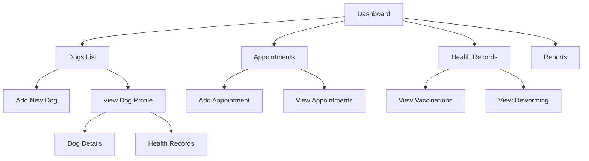

# User Flow Documentation

## Main Navigation Flows 

## Detailed User Flows

### Dog Management Flow
1. User lands on Dashboard
2. Views list of dogs with basic info
3. Can either:
   - Add new dog (via "Add dog" button)
   - View existing dog profile (via "View" link)
4. When viewing dog profile:
   - Toggle between Profile and Health Records tabs
   - View detailed information
   - Access medical history

### Appointment Management Flow
1. User accesses Appointments page
2. Views table of all appointments with:
   - Dog name
   - Appointment type
   - Date
   - Status (color-coded)
   - Notes
3. Can add new appointment via "Add Appointment" button
4. Appointments are color-coded:
   - Blue: Scheduled
   - Green: Completed
   - Red: Cancelled
