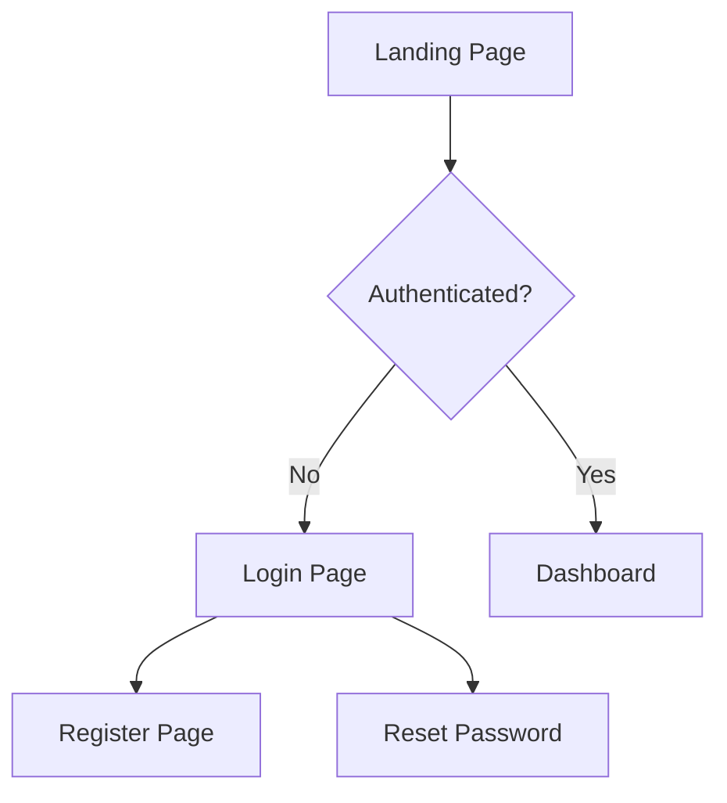
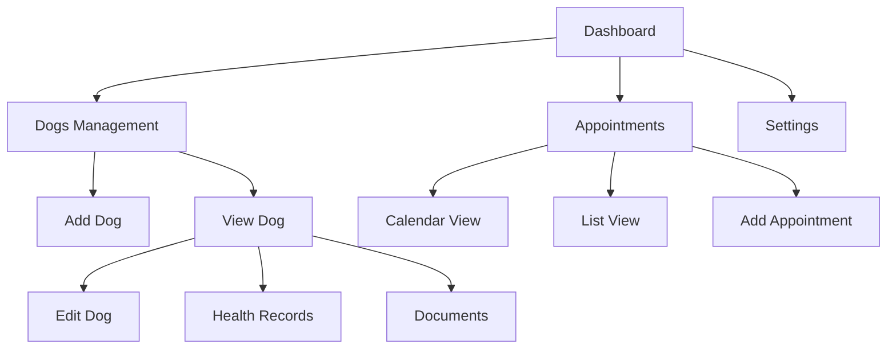

# User Flow Documentation

## Authentication Flow

## Main Application Flows

## Detailed Flows

### Authentication Flow
1. User arrives at landing page
2. If not authenticated:
   - Login with email/password
   - Register new account
   - Reset password if forgotten
3. After authentication:
   - Redirected to dashboard
   - Session maintained with JWT

### Dog Management Flow
1. Dashboard overview
2. Dogs list with:
   - Search functionality
   - Filters
   - Sort options
3. Dog profile:
   - Basic information tab
   - Health records tab
   - Appointments tab
   - Documents tab

### Appointment Management
1. View appointments:
   - Calendar view
   - List view with filters
2. Add/Edit appointments:
   - Select dog
   - Choose date/time
   - Set reminder
   - Add notes
